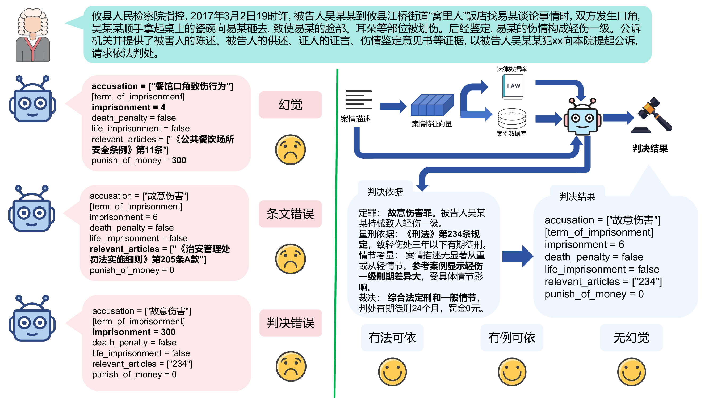
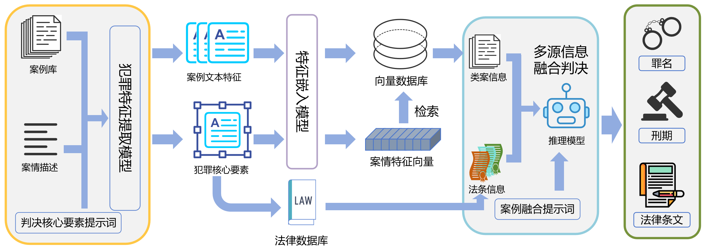
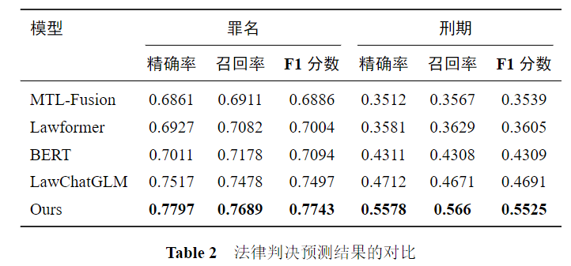

## 基于法条约束与类案融合的可解释司法判决预测方法

法律判决预测是推动司法智能化的关键研究领域。然而，当前大语言模型（LLM）在法律判决预测任务中面临显著挑战：它们在未经过专门法律知识强化的情况下，主要依赖于模型自身的固有知识进行推理，这导致其在处理复杂法律案件时容易产生“幻觉”，生成不符合法律事实或逻辑的判决，并且缺乏对专业法律知识的深度理解与精确应用能力，从而严重制约了LLM在司法实践中的可靠性与可解释性。



为克服上述挑战，本文提出一种基于法条约束与类案融合的可解释司法判决预测方法。该方法旨在通过构建一套系统性的外部法律知识引导机制，显著提升LLM在法律判决预测任务中的性能和透明度。具体而言，本方法将判决预测（LJP）任务解构为以下核心逻辑子任务：首先，利用LLM强大的文本理解能力，精准地从案件描述中抽取并识别判决所需的关键事实要素和争议焦点；其次，通过检索增强生成（RAG）机制，并行地从精心构建的专业法律条文库中检索并引用相关法律规范与条款，同时从海量的历史判例库中获取与当前案件高度相似的裁判文书与量刑依据，确保判决的法律依据充分性和实践参考性；最后，将这些从多源异构知识库中获取的法律条文、相似判例与原始案件要素一同输入LLM进行综合推理与论证，从而生成结构化、具有法律效力且可解释的判决结果。


本研究旨在通过为LLM提供明确的法律依据和司法实践参考，系统性地提升判决质量。实验结果表明，该方法在罪名预测和刑期预测任务上的F1分数分别达到0.7743和0.5525，相较于同样尝试结合外部知识库的先进基准模型，F1分数分别提升了2.46%和8.34%。这充分验证了本方法通过有效融合多源异构知识，能够显著增强判决预测的准确性。



## 开始
本项目依赖库:
```bash
pip install -r requirements.txt
```

运行一个测试案例:
```bash
python main.py
```
## 说明
`db`为相似案例的[milvus sql light](https://milvus.io/docs/zh/quickstart.md)数据，可以直接使用`pymilvus`导入
```python
from pymilvus import MilvusClient
client = MilvusClient(r'db/case.db')
client.load_collection('legal_cases')
```
>注意: Windows系统似乎无法直接使用pymilvus库，请使用Linux系统

`pkl`中的`sampled_data.pkl`是序列化以后的[CAIL](https://github.com/thunlp/CAIL/tree/master) Small数据，类型为`dict[int,dict]`，`int`为数据索引，`内层dict`为一行数据
```python
import pickle
with open("pkl/sampled_data.pkl", "rb") as f:
    data = pickle.load(f)
```

`prompt`中`extract_feature.txt`为`判决核心要素提取`的提示词，`infer.txt`为`多源信息融合推理`模板。

## 支持链接
Milvus向量数据库: [https://milvus.io/docs/zh/quickstart.md](https://milvus.io/docs/zh/quickstart.md)

CAIL 2018数据集: [https://github.com/thunlp/CAIL/tree/master](https://github.com/thunlp/CAIL/tree/master)

SAMLAB: [https://github.com/GZU-SAMLab](https://github.com/GZU-SAMLab)
